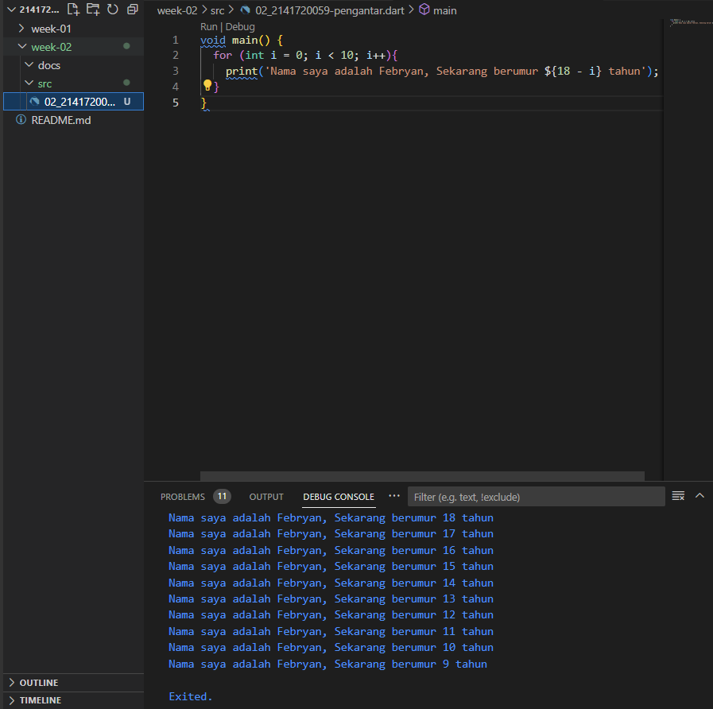

## Nama : Febryan Rizki Hidayatullah
## Nim : 2141720059
## Week 2


### Soal 1
Jawaban 


### Soal 2
Mengapa sangat penting untuk memahami bahasa pemrograman Dart sebelum kita menggunakan framework Flutter ? Jelaskan!

```
Karena Memahami Dart adalah dasar untuk bekerja dengan Flutter, Dart adalah bahasa yang digunakan untuk mengembangkan aplikasi dengan menggunakan Flutter. Memiliki pemahaman dasar yang kuat tentang Dart akan memudahkan untuk menjadi lebih produktif dengan Flutter dan akan membuat nyaman dalam pengembangan Flutter.
```

### Soal 3
Rangkumlah materi dari codelab ini menjadi poin-poin penting yang dapat Anda gunakan untuk membantu proses pengembangan aplikasi mobile menggunakan framework Flutter.

```
Main function

Dart menggunakan function dan method sebagai cara untuk memisahkan kode. Sebuah function atau method adalah potongan kode yang menerima beberapa data, eksekusi kode, dan kemudian mengembalikan beberapa data (return).

Kode dapat dieksekusi karena Dart VM mencari function main, yang kemudian memanggil function tersebut
```
### **Dart Operator**
```
Dart Operator

x.==(y) metode untuk melakukan perbandingan kesetaraan.
```
```
Arithmetic operators

+ untuk tambahan
- untuk pengurangan
* untuk perkalian
/ untuk pembagian
~/ untuk pembagian bilangan bulat.
% untuk operasi modulus (sisa bagi dari bilangan bulat).
-expression untuk negasi (yang membalikkan suatu nilai).

Dart juga menyediakan shortcut operator untuk menggabungkan variabel setelah operasi lainnya. Operator aritmatika atau shortcut operator adalah +=, -=, *=, /=, dan ~/=
```
```
Increment and decrement operators

++var atau var++ untuk menambah nilai variabel var sebesar 1
--var atau var-- untuk mengurangi nilai variabel var sebesar 1
```
```
Equality and relational operators

== untuk memeriksa apakah operan sama
!= untuk memeriksa apakah operan berbeda
> memeriksa apakah operan kiri lebih besar dari operan kanan
< memeriksa apakah operan kiri lebih kecil dari operan kanan
>= memeriksa apakah operan kiri lebih besar dari atau sama dengan operan kanan
<= memeriksa apakah operan kiri kurang dari atau sama dengan operan kanan
```
```
Logical operators

!expression negasi atau kebalikan hasil ekspresi—yaitu, true menjadi false dan false menjadi true.
|| menerapkan operasi logika OR antara dua ekspresi.
&& menerapkan operasi logika AND antara dua ekspresi.
```
### **Variabel dan tipe data**
```
deklarasi variabel

type identifier = value;

peraturan identifier
- identifier tidak boleh berupa new atau class
- cuma boleh angka dan karakter tidak boleh ada special karakter
- tidak boleh hanya angka
```
**Null Safety**
```
dart bisa memunculkan nilai null jika setelah variabel ada tanda tanya
```

```dart
void main(){
int? newNumber; // newNumber type allows nullability
print(newNumber); // Prints null
newNumber = 42; // Update the value of newNumber
print(newNumber); // Prints 42
}
```
**Late Variable**
```dart
late int newNumber; // newNumber type allows nullability
// Do some initialisation stuff
newNumber = 42; // Update the value of newNumber
print(newNumber); // Prints 42
```
**Accessing nullable variables**
```dart
int? goals;
// Other code
If (goals != null) {
print(goals + 2);
}

untuk mengecek apakah goals null atau tidak, kalau null maka tidak akan terjadi eror dan akan mengoutputkan 0
```
### **Built-in types**
```
• Numbers (such as num, int, and double)
num bisa mengakses int dan double
• Booleans (such as bool)
valuenya true or false
• Collections (such as lists, arrays, and maps)
list -> bisa untuk angka dan kata campuran dalam urutan
arrays -> hanya bisa pilih angka full atau kata full dalam urutan
maps -> untuk key and value
• Strings and runes (for expressing Unicode characters in a string)
```

### Soal 4
Buatlah slide yang berisi penjelasan dan contoh eksekusi kode tentang perbedaan Null Safety dan Late variabel ! (Khusus soal ini kelompok berupa link google slide)

Anggota Kelompok : 

link : https://docs.google.com/presentation/d/1oT5K4ch9DpX5ZJk8b1gcoet2ImcXjlNnlQtmsWTuLCk/edit#slide=id.p