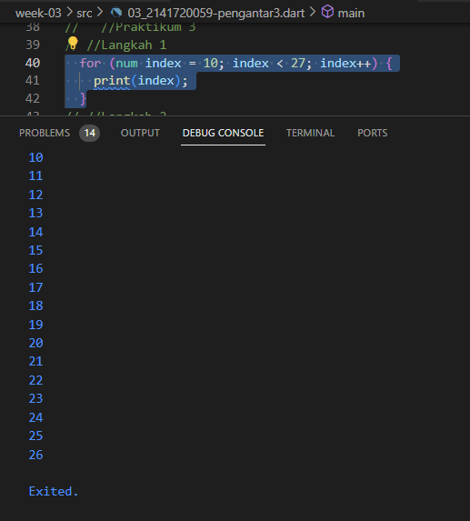

# Nama : Febryan Rizki Hidayatullah
# Nim : 2141720059
# Week 3

~~
# No 1 : Silakan selesaikan Praktikum 1 sampai 3, lalu dokumentasikan berupa screenshot hasil pekerjaan beserta penjelasannya!  
## Praktikum 1
### Langkah 1
Ketik atau salin kode program berikut ke dalam fungsi main().
```dart
String test = "test2";
if (test == "test1") {
   print("Test1");
} else If (test == "test2") {
   print("Test2");
} Else {
   print("Something else");
}

if (test == "test2") print("Test2 again");
```
### Langkah 2
Silakan coba eksekusi (Run) kode pada langkah 1 tersebut. Apa yang terjadi? Jelaskan!

jawab ->kode ini akan menampilkan print test jika test = test2. tetapi, yang terjadi eror karena penulisan dari else If dan Else salah, untuk contoh kode yng tepat


### Langkah 3
Tambahkan kode program berikut, lalu coba eksekusi (Run) kode Anda.
```dart
String test = "true";
if (test) {
   print("Kebenaran");
}
```
Apa yang terjadi ? Jika terjadi error, silakan perbaiki namun tetap menggunakan if/else.

 jawab ->kode ini akan menampilkan output kebenaran jika test=true namun terjadi eror karena variable test sudah digunakan, dan untuk true pakai type data bool, seperti ini
 

 ## Praktikum 2
 ### Langkah 1
 Ketik atau salin kode program berikut ke dalam fungsi main().
 ```dart
 while (counter < 33) {
  print(counter);
  counter++;
}
 ```

 ### Langkah 2
Silakan coba eksekusi (Run) kode pada langkah 1 tersebut. Apa yang terjadi? Jelaskan! Lalu perbaiki jika terjadi error.

jawab -> kode ini akan menampilkan angka counter sampai kurang dari 33 namun terjadi eror karena variable counter belum mempunyai type data, kode
 

 ### Langkah 3
 Tambahkan kode program berikut, lalu coba eksekusi (Run) kode Anda.
 ```dart
 do {
  print(counter);
  counter++;
} while (counter < 77);
 ```
 Apa yang terjadi ? Jika terjadi error, silakan perbaiki namun tetap menggunakan do-while.

 jawab -> kode ini akan menampilkan counter sampai kurang dari 77 dan tidak terjadi eror karena typedata counter sudah di cantumkan diatas

  

  ## Praktikum 3
  ### Langkah 1
  Ketik atau salin kode program berikut ke dalam fungsi main().
  ```dart
  for (Index = 10; index < 27; index) {
  print(Index);
}
  ```
  ### Langkah 2
  Silakan coba eksekusi (Run) kode pada langkah 1 tersebut. Apa yang terjadi? Jelaskan! Lalu perbaiki jika terjadi error.

  jawab -> kode ini akan menampilkan nilai index dari 10 - 26 namun terjadi eror karena variabel index ditulis dengan tidak sama, dan juga belum mempunyai typedata, perbaikan
   

   ### Langkah 3
   Tambahkan kode program berikut di dalam for-loop, lalu coba eksekusi (Run) kode Anda.
   ```dart
   If (Index == 21) break;
Else If (index > 1 || index < 7) continue;
print(index);
   ```
   Apa yang terjadi ? Jika terjadi error, silakan perbaiki namun tetap menggunakan for dan break-continue.

   jawab -> kode ini akan menampilkan nilai index dari awal yang sudah ditentukan sampai akhir namun terjadi eror karena if, index, else if penamaannya salah, dan juga index > 1 || index < 7 tidak akan menghasilkan output apa2 jika index dimulai dari 1, perbaikan
   
# No 2 : Buatlah sebuah program yang dapat menampilkan bilangan prima dari angka 0 sampai 201 menggunakan Dart. Ketika bilangan prima ditemukan, maka tampilkan nama lengkap dan NIM Anda.

## kode

## output
