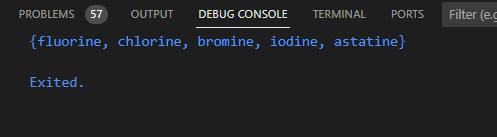
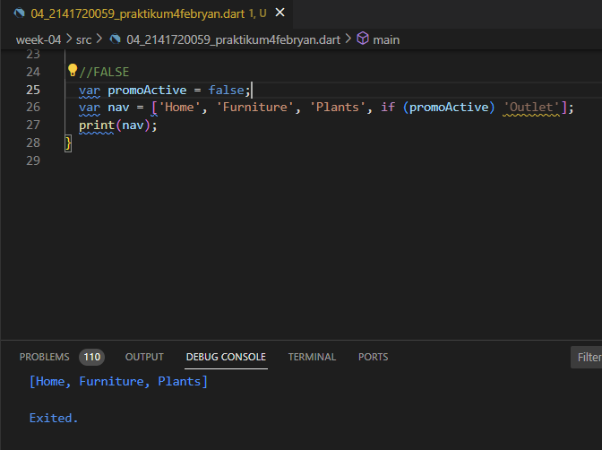
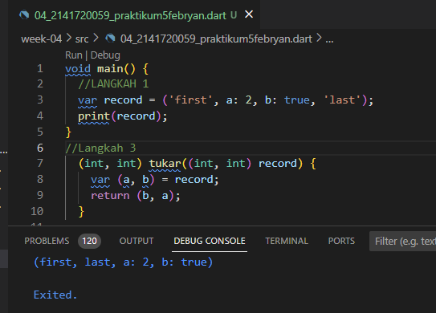
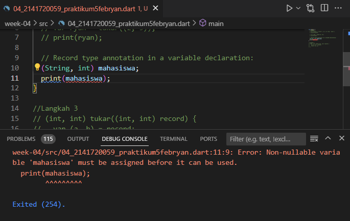

# Nama : Febryan Rizki Hidayatullah
# Kelas : TI-2F
# Nim : 2141720059
# WEEK 4
~~
# Daftar isi
Soal | Jawaban |
:---:|:-------:|
1 | [Soal 1](#-1.-Silakan-selesaikan-Praktikum-1)
|  | [Praktikum 1](#praktikum-1)
|  | [Praktikum 2](#praktikum-2)
|  | [Praktikum 3](#praktikum-3)
|  | [Praktikum 4](#praktikum-4)
|  | [Praktikum 5](#praktikum-5)
2 | [Soal 2](#2-jelaskan-yang-dimaksud-functions-dalam-bahasa-dart)
3 | [Soal 3](#3-jelaskan-jenis-jenis-parameter-di-functions-beserta-contoh-sintaksnya)
4 | [Soal 4](#4-jelaskan-maksud-functions-sebagai-first-class-objects-beserta-contoh-sintaknya)
5 | [Soal 5](#5-apa-itu-anonymous-functions-jelaskan-dan-berikan-contohnya)
6 | [Soal 6](#6-jelaskan-perbedaan-lexical-scope-dan-lexical-closures-berikan-contohnya)
7 | [Soal 7](#7-jelaskan-dengan-contoh-cara-membuat-return-multiple-value-di-functions)
## Tugas Praktikum
### 1. Silakan selesaikan Praktikum 1 sampai 5, lalu dokumentasikan berupa screenshot hasil pekerjaan Anda beserta penjelasannya!  
#### Praktikum 1
##### Langkah 1
```dart
var list = [1, 2, 3];
assert(list.length == 3);
assert(list[1] == 2);
print(list.length);
print(list[1]);

list[1] = 1;
assert(list[1] == 1);
print(list[1]);
```

##### Langkah 2
Silakan coba eksekusi (Run) kode pada langkah 1 tersebut. Apa yang terjadi? Jelaskan!
  
```kode ini memberikan output urut sesuai print yang di atas```
##### Langkah 3
Ubah kode pada langkah 1 menjadi variabel final yang mempunyai index = 5 dengan default value = null. Isilah nama dan NIM Anda pada elemen index ke-1 dan ke-2. Lalu print dan capture hasilnya.
 
```kode diatas terdapat eror karena tidak string dan tidak default null ``` 
perbaikan  
 
#### Praktikum 2
##### Langkah 1
Ketik atau salin kode program berikut ke dalam fungsi main().
```dart
var halogens = {'fluorine', 'chlorine', 'bromine', 'iodine', 'astatine'};
print(halogens);
```
 
##### Langkah 2
Silakan coba eksekusi (Run) kode pada langkah 1 tersebut. Apa yang terjadi? Jelaskan! Lalu perbaiki jika terjadi error.
 
```tidak terjadi eror, kode ini menampilkan isi dari variable halogens```
##### Langkah 3
Tambahkan kode program berikut, lalu coba eksekusi (Run) kode Anda.
```dart
var names1 = <String>{};
Set<String> names2 = {}; // This works, too.
var names3 = {}; // Creates a map, not a set.

print(names1);
print(names2);
print(names3);
```
 Apa yang terjadi ? Jika terjadi error, silakan perbaiki namun tetap menggunakan ketiga variabel tersebut. Tambahkan elemen nama dan NIM Anda pada kedua variabel Set tersebut dengan dua fungsi berbeda yaitu .add() dan .addAll(). Untuk variabel Map dihapus, nanti kita coba di praktikum selanjutnya.  

``` kode ini menampilkan {} kosong karena belum diisi jadi ditambahkan add```
  
 #### Praktikum 3
 ##### Langkah 1
 Ketik atau salin kode program berikut ke dalam fungsi main().
 ```dart
 var gifts = {
  // Key:    Value
  'first': 'partridge',
  'second': 'turtledoves',
  'fifth': 1
};

var nobleGases = {
  2: 'helium',
  10: 'neon',
  18: 2,
};

print(gifts);
print(nobleGases);
 ```
 
##### Langkah 2
Silakan coba eksekusi (Run) kode pada langkah 1 tersebut. Apa yang terjadi? Jelaskan! Lalu perbaiki jika terjadi error.
 
##### Langkah 3
Tambahkan kode program berikut, lalu coba eksekusi (Run) kode Anda.
```dart
var mhs1 = Map<String, String>();
gifts['first'] = 'partridge';
gifts['second'] = 'turtledoves';
gifts['fifth'] = 'golden rings';

var mhs2 = Map<int, String>();
nobleGases[2] = 'helium';
nobleGases[10] = 'neon';
nobleGases[18] = 'argon';
```
Apa yang terjadi ? Jika terjadi error, silakan perbaiki.
 
```kode ini memperbaiki assignment dari variabel mhs1 dan mhs2 ``` 

Tambahkan elemen nama dan NIM Anda pada tiap variabel di atas (gifts, nobleGases, mhs1, dan mhs2). Dokumentasikan hasilnya dan buat laporannya!
 
#### Praktikum 4
##### Langkah 1
Ketik atau salin kode program berikut ke dalam fungsi main().
```dart
var list = [1, 2, 3];
var list2 = [0, ...list];
print(list1);
print(list2);
print(list2.length);
```
 
##### Langkah 2
Silakan coba eksekusi (Run) kode pada langkah 1 tersebut. Apa yang terjadi? Jelaskan! Lalu perbaiki jika terjadi error.
 
```terdapat eror karena nama variabel list dan list1 tidak sama, maka disamakan dengan list1 saja```
 
##### Langkah 3
Tambahkan kode program berikut, lalu coba eksekusi (Run) kode Anda.
```dart
list1 = [1, 2, null];
print(list1);
var list3 = [0, ...?list1];
print(list3.length);
```
Apa yang terjadi ? Jika terjadi error, silakan perbaiki.

```terjadi eror karena list1 tidak ada type data dan ...?list tidak usah pakai tanda tanya```

Tambahkan variabel list berisi NIM Anda menggunakan Spread Operators. Dokumentasikan hasilnya dan buat laporannya!

##### Langkah 4
Tambahkan kode program berikut, lalu coba eksekusi (Run) kode Anda.
```dart
var nav = ['Home', 'Furniture', 'Plants', if (promoActive) 'Outlet'];
print(nav);
```
Apa yang terjadi ? Jika terjadi error, silakan perbaiki.
 
```promoActive belum di kasih type data```
Tunjukkan hasilnya jika variabel promoActive ketika true dan false.  
```false```

```true```

##### Langkah 5
Tambahkan kode program berikut, lalu coba eksekusi (Run) kode Anda.
```dart
var nav2 = ['Home', 'Furniture', 'Plants', if (login case 'Manager') 'Inventory'];
print(nav2);
```
Apa yang terjadi ? Jika terjadi error, silakan perbaiki. Tunjukkan hasilnya jika variabel login mempunyai kondisi lain.

```perbaikan```  
  
```kondisi lain```  

##### Langkah 6
Tambahkan kode program berikut, lalu coba eksekusi (Run) kode Anda.
```dart
var listOfInts = [1, 2, 3];
var listOfStrings = ['#0', for (var i in listOfInts) '#$i'];
assert(listOfStrings[1] == '#1');
print(listOfStrings);
```
Apa yang terjadi ? Jika terjadi error, silakan perbaiki. Jelaskan manfaat Collection For dan dokumentasikan hasilnya.

```tidak terjadi eror, manfaat dari Collection For adalah membuat dan menginisialisasi koleksi seperti list, set, atau map dengan sintaks yang lebih ringkas```
#### Praktikum 5
##### Langkah 1
Ketik atau salin kode program berikut ke dalam fungsi main().
```dart
var record = ('first', a: 2, b: true, 'last');
print(record)
```

##### Langkah 2
Silakan coba eksekusi (Run) kode pada langkah 1 tersebut. Apa yang terjadi? Jelaskan! Lalu perbaiki jika terjadi error.

```tidak terjadi eror, kode ini mengeluarkan output dari record dengan urutan first, last, a:2, b:true```
##### Langkah 3
Tambahkan kode program berikut di luar scope void main(), lalu coba eksekusi (Run) kode Anda.
```dart
(int, int) tukar((int, int) record) {
  var (a, b) = record;
  return (b, a);
}
```
Apa yang terjadi ? Jika terjadi error, silakan perbaiki. 

```tidak terjadi eror dan tidak merubah apapun```  

Gunakan fungsi tukar() di dalam main() sehingga tampak jelas proses pertukaran value field di dalam Records.

##### Langkah 4
Tambahkan kode program berikut di dalam scope void main(), lalu coba eksekusi (Run) kode Anda.
```dart
// Record type annotation in a variable declaration:
(String, int) mahasiswa;
print(mahasiswa);
```
Apa yang terjadi ? Jika terjadi error, silakan perbaiki. Inisialisasi field nama dan NIM Anda pada variabel record mahasiswa di atas. Dokumentasikan hasilnya dan buat laporannya!

```terjadi eror karena mahasiswa bernilai null```  

##### Langkah 5
Tambahkan kode program berikut di dalam scope void main(), lalu coba eksekusi (Run) kode Anda.
```dart
var mahasiswa2 = ('first', a: 2, b: true, 'last');

print(mahasiswa2.$1); // Prints 'first'
print(mahasiswa2.a); // Prints 2
print(mahasiswa2.b); // Prints true
print(mahasiswa2.$2); // Prints 'last'
```
Apa yang terjadi ? Jika terjadi error, silakan perbaiki.  

Gantilah salah satu isi record dengan nama dan NIM Anda, lalu dokumentasikan hasilnya dan buat laporannya!


### 2. Jelaskan yang dimaksud Functions dalam bahasa Dart!
jawab  
```Functions dalam bahasa dart adalah blok kode yang dapat dieksekusi secara terpisah dan dapat digunakan untuk melakukan tugas tertentu atau mengembalikan nilai.```
### 3. Jelaskan jenis-jenis parameter di Functions beserta contoh sintaksnya!
jawab  
- required positional parameters
  ```dart
  sayHappyBirthday(String name, int age) {
    return "$name is ${age.toString()} years old";
    }
  ```
  ```dart
  //to call this function in main
  sayHappyBirthday("Laura", 21);
  ```
- optional positional parameters
  ```dart
  sayHappyBirthday(String name, [int? age]) {
    return "$name is $age years old";}
  ```
  or
  ```dart
  sayHappyBirthday(String name, [int age = 21]) {
    return "Happy birthday $name! You are $age years old.";}
  ```
  ```dart
  //to call
  void main() {
    var hello = sayHappyBirthday('Robert');
    print(hello);}// Prints Happy birthday Robert! You are 21 years old
  ```
- named parameters
  ```dart
  void greet({String name, int age}) {
  print("Hello, $name! You are $age years old.");
  }greet(age: 25, name: "Alice");  // Output: Hello, Alice! You are 25 years old.
  ```
- default parameters
  ```dart
  void greet(String name, {String message = "Hello"}) {
  print("$message, $name!");
  }
  greet("Alice");  // Output: Hello, Alice!
  greet("Bob", message: "Hi");  // Output: Hi, Bob!
  ```
### 4. Jelaskan maksud Functions sebagai first-class objects beserta contoh sintaknya!
jawab  
```Functions adalah first-class objects. Ini berarti fungsi dalam Dart dapat diperlakukan seperti objek lainnya, seperti integer, string, atau list. Kita dapat menyimpan fungsi dalam variabel, meneruskannya sebagai argumen ke fungsi lain, mengembalikannya sebagai nilai dari fungsi, atau membuatnya secara dinamis.```
### 5. Apa itu Anonymous Functions? Jelaskan dan berikan contohnya!
jawab  
```Anonymous functions (fungsi anonim) adalah fungsi yang tidak memiliki nama identifikasi yang spesifik. Mereka juga dikenal sebagai lambda functions, function literals, atau arrow functions, tergantung pada bahasa pemrograman yang digunakan. Fungsi anonim biasanya digunakan ketika kita hanya perlu menggunakan fungsi tersebut dalam konteks tertentu dan tidak perlu memberinya nama.```
```dart
void main() {
List = [1, 2, 3, 4];
list.forEach((number) => print('hello $number'));
}
```
### 6. Jelaskan perbedaan Lexical scope dan Lexical closures! Berikan contohnya!
jawab  
- Lexical Scope
  ```Lexical scope (lingkup leksikal) mengacu pada cara variabel diresolusi berdasarkan struktur fisik kode pada saat kompilasi. Dalam lexical scope, akses variabel ditentukan oleh lokasi di mana variabel tersebut dideklarasikan dalam kode. jadi inner function dapat mengakses variabel ke tingkat global```
  ```dart
  globalFunction() {
    print("Top-level globalFunction");
    }
    simpleFunction() { 
        print("SimpleFunction"); 
        globalFunction() {
            print("Nested globalFunction");
    }
        globalFunction();
    }
    main() {
        simpleFunction();
        globalFunction();
    }
    //output simpleFunction Nested globalFunction Top-level globalFunction
  ```
  ```Saat main memanggil simpleFunction maka fungsi nested globalFunction didefinisikan, memblokir akses ke top-level globalFunction. Kapan globalFunction dipanggil, itu adalah versi nested yang dipanggil.Sebaliknya, ketika fungsi main memanggil fungsi globalFunction, fungsi globalFunction top-level dipanggil karena, dalam lingkup ini, nested fungsi globalFunction dari simpleFunction tidak didefinisikan.Oleh karena itu, output dari memanggil metode utama adalah ini```
  - simple function
  - nested globalFunction
  - top-level globalFunction
- Lexical Closures
  ```Lexical closures (penutupan leksikal) mengacu pada kemampuan fungsi untuk mengakses dan "mengingat" variabel yang ada dalam lingkup leksikal fungsi tersebut, bahkan setelah fungsi tersebut selesai dieksekusi atau dikeluarkan dari lingkup aslinya.```
  ```dart
  Function outerFunction() {
  int x = 10;

  Function innerFunction() {
    return () {
      print(x); // Mengakses variabel x dari outerFunction
    };
  }

  return innerFunction();
  }
  void main() {
  var closure = outerFunction();
  closure(); // Output: 10
    }
  ```
  ```Dalam lexical closures, fungsi "mengunci" (mengabadikan) referensi ke variabel yang ada dalam lingkup leksikalnya, sehingga variabel tersebut tetap dapat diakses bahkan setelah fungsi tersebut selesai dieksekusi atau dikeluarkan dari lingkup aslinya.```
### 7. Jelaskan dengan contoh cara membuat return multiple value di Functions!
jawab  
- Menggunakan List atau Map:  
    Kita dapat menggunakan List atau Map untuk mengelompokkan nilai-nilai yang ingin kita kembalikan sebagai multiple values.  
    contoh dengan List
    ```dart
    List<int> getNumbers() {
    int a = 1;
    int b = 2;
    int c = 3;
    return [a, b, c];
    }

    void main() {
    List<int> numbers = getNumbers();
    print(numbers); // Output: [1, 2, 3]
    }
    ```
    Contoh dengan Map
    ```dart
    Map<String, int> getNumbers() {
    int a = 1;
    int b = 2;
    int c = 3;
    return {'a': a, 'b': b, 'c': c};
    }

    void main() {
    Map<String, int> numbers = getNumbers();
    print(numbers); // Output: {a: 1, b: 2, c: 3}
    }
    ``` 
- Menggunakan objek khusus  
    Kita juga dapat membuat objek khusus yang mengemas nilai-nilai yang ingin dikembalikan sebagai multiple values.

    contoh
    ```dart
    class Result {
  int sum;
  int difference;

  Result(this.sum, this.difference);
    }

    Result performCalculations(int a, int b) {
    int sum = a + b;
    int difference = a - b;
    return Result(sum, difference);
    }

    void main() {
  Result result = performCalculations(5, 3);
  print(result.sum); // Output: 8
  print(result.difference); // Output: 2
    }
    ```
    Dalam contoh di atas, kita membuat kelas Result yang memiliki properti sum dan difference. Fungsi performCalculations() melakukan perhitungan dan mengembalikan objek Result yang berisi nilai-nilai yang ingin dikembalikan sebagai multiple values.