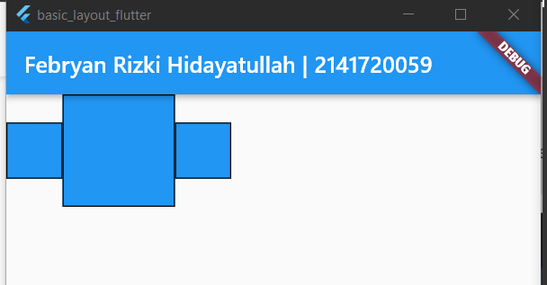
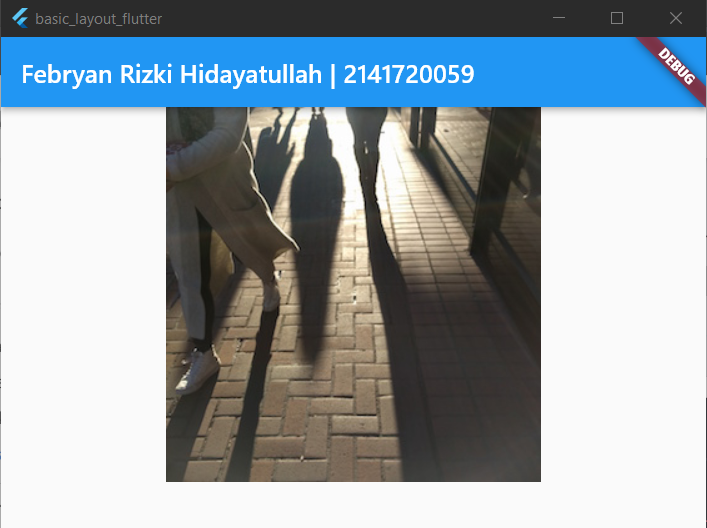

# Nama : Febryan Rizki Hidayatullah
# Kelas : TI-2F
# Nim : 2141720059
# WEEK 7
~~
# Daftar Isi
| no | jawaban |
| :-: | :-----: |
| 1 | [Soal](#1-selesaikan-praktikum-1-sampai-4-lalu-dokumentasikan-dan-push-ke-repository-anda-berupa-screenshot-setiap-hasil-pekerjaan-beserta-penjelasannya-di-file-readmemd) |
| | [Praktikum 1](#praktikum-1-membangun-layout-di-flutter) |
| | [Praktikum 2](#praktikum-2-implementasi-button-row) |
| | [Praktikum 3](#praktikum-3-implementasi-text-section) |
| | [Praktikum 4](#praktikum-4-implementasi-image-section) |
| 2 | [Soal](#2-silakan-implementasikan-di-project-baru-basic_layout_flutter-dengan-mengakses-sumber-ini-httpsdocsflutterdevcodelabslayout-basics) | 

# 1. Selesaikan Praktikum 1 sampai 4, lalu dokumentasikan dan push ke repository Anda berupa screenshot setiap hasil pekerjaan beserta penjelasannya di file README.md!
## Praktikum 1: Membangun Layout di Flutter 
### Langkah 1: Buat Project Baru

### Langkah 2: Buka file lib/main.dart

### Langkah 3: Identifikasi layout diagram
  


#### Hasil Running Praktikum 1
```
Pada Praktikum 1 kita membuat widget baru bernama titleSection yang berisi beberapa widget dan menampilkan Text serta Icon dalam 1 row
```

## Praktikum 2: Implementasi button row
### Langkah 1: Buat method Column _buildButtonColumn

### Langkah 2: Buat widget buttonSection

### Langkah 3: Tambah button section ke body

#### Hasil Run Praktikum 2
  
pada praktikum 2 ditambahkan 1 widget bernama buttonSection yang ambil dari metod _buildButtonColumn untuk menampilkan 3 icon, 3 label, dan warna.
## Praktikum 3: Implementasi text section
### Langkah 1: Buat widget textSection

### Langkah 2: Tambahkan variabel text section ke body

#### Hasil Run Praktikum 3
menambahkan berupa text dibawah icon2
## Praktikum 4: Implementasi image section
### Langkah 1: Siapkan aset gambar

### Langkah 2: Tambahkan gambar ke body

### Langkah 3: Terakhir, ubah menjadi ListView

#### Hasil Run Praktikum 4

menambahkan berupa gambar yang diupload ke folder assets lalu dipanggil ke body main.dart

#### Hasil Akhir 
  
disini saya mengubah nama dan lokasi dan mengubah children column menjadi listview agar bisa discroll ke atas bawah

# 2. Silakan implementasikan di project baru "basic_layout_flutter" dengan mengakses sumber ini: https://docs.flutter.dev/codelabs/layout-basics
Jawab  
| judul | sebelum di ubah | setelah di ubah | Keterangan |
| :---: | :-------------: | :-------------: | :--------: |
| Row and Column classes |  |  | mengubah widget Row() menjadi Column(), jelas terlihat perubahan |
| Axis size and alignment |
| mainAxisSize property |  |  | mengubah mainAxisSize.max menjadi mainAxisAlignment.min, seperti tidak terlihat perubahan pada gambar |
| mainAxisAlignment property |  |  | mengubah mainAxisAlignment.start menjadi mainAxisAlignment.end merubah posisi bluebox dari pojok kiri ke pojok kanan |
| crossAxisAlignment property |  |  | mengubah crossAxisAlignment.center menjadi crossAxisAlignment.start mengubah posisi bluebox kecil dari tengah menjadi lebih ke atas |
| Flexible widget |  |  | mengubah flexFit.loose menjadi flexFit.tight dimana flexFit.loose tidak bisa memanjang melebihi ukuran namun bisa menyusut, sedangkan tight bisa memanjang tanpa melebihi layar tapi juga tidak menjadikan full dan menyusut |
| Expanded widget |  |  | wrap bluebox yang kedua dengan widget expanded menjadikan bluebox kedua bisa memanjang sampai ke full layar tanpa melebihi layar tsb | 
| SizedBox widget |  |  | mengubah bluebox kedua dengan menambahkan height dan weight sesuai dengan yang di inputkan user |
| Spacer widget |  |  | menambahkan satu spacer(flex: 1) diantara bluebox 2 dan 3 menjadikan bluebox kedua ke tengah
| Text Widget |  |  | mengubah crossAxisAlignment.center ke crossAxisAlignment.baseline merubah text yang awalnya sejajar di tengah menjadi sejajar dari bawah
| Icon Widget |  |  | menambahkan satu icons.widget dengan warna amber
| Image Widget |  |    | menambahkan link pada image.network dengan link dan mengubah pic1 dengan pic2 dan juga pic3
| putting it all together | part 1   | part 2    part 3   | menambahkan semua yang telah dipelajari menjadi satu