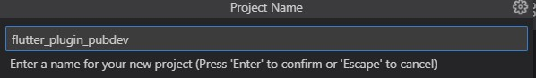
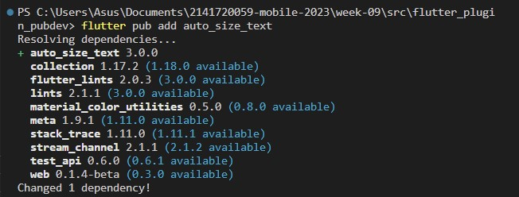
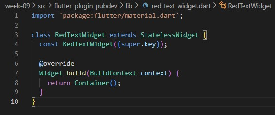
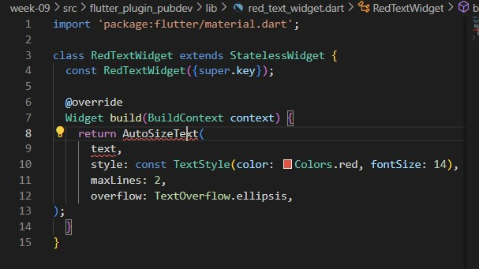
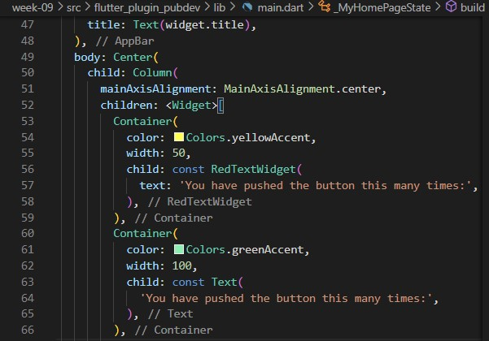
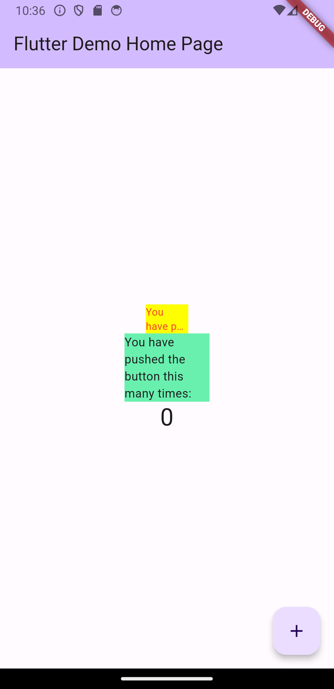

# Nama : Febryan Rizki Hidayatullah
# Kelas : TI-3F
# Nim : 2141720059
# WEEK 9
~~

## 1.Selesaikan Praktikum tersebut, lalu dokumentasikan dan push ke repository Anda berupa screenshot hasil pekerjaan beserta penjelasannya di file README.md!

### Langkah 1: Buat Project Baru


### Langkah 2: Menambahkan Plugin


### Langkah 3: Buat file red_text_widget.dart


### Langkah 4: Tambah Widget AutoSizeText

```
terjadi eror karena package AutoSizeText belum di import ke main, dan text belum dimasukkan ke container
```

### Langkah 5: Buat Variabel text dan parameter di constructor


### Langkah 6: Tambahkan widget di main.dart


### Run


## 2.Jelaskan maksud dari langkah 2 pada praktikum tersebut!
```
flutter pub add auto_size_text akan menambahkan plugin bernama auto_size_text dan akan ditambahkan ke pubspec.yaml dibagian dependencies dan bisa diakses sebagai widget
```

## 3.Jelaskan maksud dari langkah 5 pada praktikum tersebut!
```
variabel text ditambahkan ke constructor RedTextWidget dengan tipe data String dan juga required(wajib di isi tidak null) supaya bisa dipakai di beda file dan diganti2 isi textnya 
```

## 4.Pada langkah 6 terdapat dua widget yang ditambahkan, jelaskan fungsi dan perbedaannya!
```
fungsinya menampilkan text yang dibungkus dengan container. perbedaannya ada di warna, width, dan juga child. widget container pertama berwarna kuning dan width 50 serta child memakai widget RedTextWidget yang memakai AutoSizeText dan hasilnya hanya 2 line dan selebihnya di overflow elipsis, container kedua memakai widget text, sehingga semua tulisan ditampilkan
```

## 5.Jelaskan maksud dari tiap parameter yang ada di dalam plugin auto_size_text berdasarkan tautan pada dokumentasi ini !

| Parameter | Description |
| :-------: | :---------: |
| Key * | mengidentifikasi widget dalam widget tree flutter |
| textKey | Key yang bisa digunakan untuk mengidentifikasi teks. |
| style * | Menentukan gaya teks, termasuk properti-properti seperti ukuran font, warna, dll. |
| minFontSize | Ukuran font minimum yang akan digunakan saat melakukan penyesuaian otomatis ukuran teks |
| maxFontSize | Ukuran font maksimum yang akan digunakan saat melakukan penyesuaian otomatis ukuran teks |
| stepGranularity | digunakan saat menyesuaikan ukuran teks |
| presetFontSizes | digunakan dalam penyesuaian ukuran teks |
| group | Digunakan untuk mengelompokkan beberapa widget AutoSizeText bersama untuk menyesuaikan ukuran teks mereka bersamaan |
| textAlign * | Menentukan perataan teks seperti 'left', 'center', 'right', dan sebagainya |
| textDirection * | Menentukan arah teks seperti 'ltr' (kiri ke kanan) atau 'rtl' (kanan ke kiri) |
| locale * | Menentukan bahasa atau lokasi untuk penulisan teks |
| softWrap * | Menentukan apakah teks akan dilipat secara otomatis ke baris berikutnya jika tidak cukup ruang |
| wrapWords | Menentukan apakah kata-kata akan dibungkus ke baris berikutnya jika tidak cukup ruang |
| overflow * | Menentukan perilaku teks saat tidak cukup ruang, misalnya 'ellipsis' akan menampilkan titik-titik jika teks terpotong |
| overflowReplacement | Widget alternatif yang akan ditampilkan sebagai pengganti teks yang terpotong |
| textScaleFactor * | Faktor skala yang digunakan untuk memperbesar atau mengecilkan teks |
| maxLines | umlah maksimum baris teks yang akan ditampilkan |
| semanticLabel * | digunakan untuk aksesibilitas atau pembaca layar |