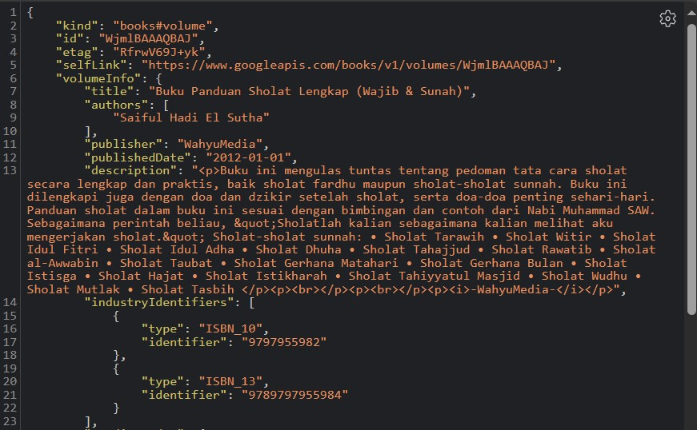

# Nama : Febryan Rizki Hidayatullah
# Kelas : TI-3F
# Nim : 2141720059
# WEEK 12
~~

# Daftar Isi
| praktikum | soal |
| :-------: | :--: |
| Praktikum 1: Mengunduh Data dari Web Service (API) | [Soal 1](#soal-1) |
| Praktikum 1: Mengunduh Data dari Web Service (API) | [Soal 2](#soal-2) |
| Praktikum 1: Mengunduh Data dari Web Service (API) | [Soal 3](#soal-3) |
--
| Praktikum 2: Menggunakan await/async untuk menghindari callbacks | [Soal 4](#soal-4) |
--
| Praktikum 3: Menggunakan Completer di Future | [Soal 5](#soal-5) |
| Praktikum 3: Menggunakan Completer di Future | [Soal 6](#soal-6) |
--
| Praktikum 4: Memanggil Future secara paralel | [Soal 7](#soal-7) |
| Praktikum 4: Memanggil Future secara paralel | [Soal 8](#soal-8) |
--
| Praktikum 5: Menangani Respon Error pada Async Code | [Soal 9](#soal-9) |
| Praktikum 5: Menangani Respon Error pada Async Code | [Soal 10](#soal-10) |
--
| Praktikum 6: Menggunakan Future dengan StatefulWidget | [Soal 11](#soal-11) |
| Praktikum 6: Menggunakan Future dengan StatefulWidget | [Soal 12](#soal-12) |
--
| Praktikum 7: Manajemen Future dengan FutureBuilder | [Soal 13](#soal-13) |
| Praktikum 7: Manajemen Future dengan FutureBuilder | [Soal 14](#soal-14) |
--
| Praktikum 8: Navigation route dengan Future Function | [Soal 15](#soal-15) |
| Praktikum 8: Navigation route dengan Future Function | [Soal 16](#soal-16) |
--
| Praktikum 9: Memanfaatkan async/await dengan Widget Dialog | [Soal 17](#soal-17) |

# Praktikum 1
### Soal 1
Tambahkan nama panggilan Anda pada title app sebagai identitas hasil pekerjaan Anda.
```dart
return MaterialApp(
      title: 'Flutter Demo Febryan',
```

### Soal 2
Carilah judul buku favorit Anda di Google Books, lalu ganti ID buku pada variabel path di kode tersebut. Caranya ambil di URL browser Anda seperti gambar berikut ini.  
</img>

Kemudian cobalah akses di browser URI tersebut dengan lengkap seperti ini. Jika menampilkan data JSON, maka Anda telah berhasil. Lakukan capture milik Anda dan tulis di README pada laporan praktikum. Lalu lakukan commit dengan pesan **"W12: Soal 2"**.
</img>

### Soal 3
- Jelaskan maksud kode langkah 5 tersebut terkait substring dan catchError!  

result = value.body.toString().substring(0, 450);: Membuat substring dari 0 hingga 449 karakter dari nilai body (mungkin response dari suatu permintaan HTTP atau sumber data lainnya) yang dikonversi ke dalam bentuk string. Substring ini kemudian disimpan dalam variabel result.

catchError((_) {...}): Ini digunakan untuk menangani kesalahan (error) yang terjadi saat getData() gagal dilakukan.  
result = 'An error occured'; : Mengubah nilai variabel result menjadi string 'An error occurred' sebagai tanda bahwa terjadi kesalahan.
setState(() {});: Kembali memanggil setState() untuk memberitahu Flutter bahwa state telah berubah, dan tampilan perlu diperbarui.  
- Capture hasil praktikum Anda berupa GIF dan lampirkan di README. Lalu lakukan commit dengan pesan "W12: Soal 3".  
</img>

#### code praktikum 1
```dart
import 'package:flutter/material.dart';
import 'package:http/http.dart';
import 'package:http/http.dart' as http;

void main() {
  runApp(const MyApp());
}

class MyApp extends StatelessWidget {
  const MyApp({super.key});

  // This widget is the root of your application.
  @override
  Widget build(BuildContext context) {
    return MaterialApp(
      title: 'Flutter Demo Febryan',
      theme: ThemeData(
        primarySwatch: Colors.blue,
        visualDensity: VisualDensity.adaptivePlatformDensity,
      ),
      home: const FuturePage(),
    );
  }
}

class FuturePage extends StatefulWidget {
  const FuturePage({super.key});

  @override
  State<FuturePage> createState() => _FuturePageState();
}

class _FuturePageState extends State<FuturePage> {
  String result = '';

  Future<Response> getData() async {
    const authority = 'www.googleapis.com';
    const path = '/books/v1/volumes/WjmlBAAAQBAJ';
    Uri url = Uri.https(authority, path);
    return http.get(url);
  }

  @override
  Widget build(BuildContext context) {
    return Scaffold(
      appBar: AppBar(
        title: const Text('Back from the Future'),
      ),
      body: Center(
        child: Column(children: [
          const Spacer(),
          ElevatedButton(
              onPressed: () {
                setState(() {});
                getData().then((value) {
                  result = value.body.toString().substring(0, 450);
                  setState(() {});
                }).catchError((_) {
                  result = 'An error occured';
                  setState(() {});
                });
              },
              child: const Text('GO!')),
          const Spacer(),
          Text(result),
          const Spacer(),
          const CircularProgressIndicator(),
          const Spacer()
        ]),
      ),
    );
  }
}
```

# Praktikum 2
### Soal 4
- Jelaskan maksud kode langkah 1 dan 2 tersebut!  
await Future.delayed(const Duration(seconds: 3));: Ini adalah operasi penundaan selama 3 detik menggunakan Future.delayed. dan digunakan selama 3 kali hasilnya menjadi delay 9 detik. dan mereturnkan nilai masing2 
Future count digunakan untuk menjumlahkan returnOne yang bernilai 1 lalu returnTwo yang bernilai 2 dan returnThree yang bernilai 3 disertai delay 3 detik dari masing2 Future
- Capture hasil praktikum Anda berupa GIF dan lampirkan di README. Lalu lakukan commit dengan pesan "W12: Soal 4".  
</img>

# Praktikum 3
### Soal 5
- Jelaskan maksud kode langkah 2 tersebut!
maksud kode langkah 2 adalah getNumber memanggil calculate dimana calculate mempunyai delay 5s dan nilai 42 dan di panggil lewat completer.future yang ada di getNumber.
- Capture hasil praktikum Anda berupa GIF dan lampirkan di README. Lalu lakukan commit dengan pesan "W12: Soal 5".  
</img>

### Soal 6
- Jelaskan maksud perbedaan kode langkah 2 dengan langkah 5-6 tersebut!  
Versi dengan try-catch memberikan perlindungan terhadap kesalahan yang mungkin terjadi selama penundaan.  
Versi tanpa try-catch lebih sederhana dan tidak menangani kesalahan secara eksplisit.
- Capture hasil praktikum Anda berupa GIF dan lampirkan di README. Lalu lakukan commit dengan pesan "W12: Soal 6".  
</img>  

# Praktikum 4
### Soal 7
- Capture hasil praktikum Anda berupa GIF dan lampirkan di README. Lalu lakukan commit dengan pesan "W12: Soal 7"  
</img>  

### Soal 8
- Jelaskan maksud perbedaan kode langkah 1 dan 4!  

jawab -> Perbedaan utama antara keduanya terletak pada cara mengelola dan menunggu kelompok Future. Langkah 1 menggunakan objek FutureGroup, sedangkan Langkah 4 langsung menggunakan Future.wait untuk menangani beberapa Future secara bersamaan. Langkah 4 dapat dianggap lebih langsung dan mudah dipahami, sementara Langkah 1 menunjukkan pendekatan yang lebih modular dengan penggunaan objek FutureGroup.

# Praktikum 5
### Soal 9
- Capture hasil praktikum Anda berupa GIF dan lampirkan di README. Lalu lakukan commit dengan pesan "W12: Soal 9".  
</img>  

### Soal 10
- Panggil method handleError() tersebut di ElevatedButton, lalu run. Apa hasilnya? Jelaskan perbedaan kode langkah 1 dan 4!  
</img>  
perbedaan -> 
Perbedaan utama terletak pada pendekatan penanganan kesalahan. Kode pertama menggunakan metode .then().catchError().whenComplete() untuk menangani hasil atau kesalahan yang mungkin terjadi dari returnError(), sedangkan kode kedua menggunakan blok try-catch-finally di dalam fungsi handleError() untuk secara langsung menangkap dan menangani error yang muncul dari pemanggilan returnError(), dengan bagian finally digunakan untuk mengeksekusi kode akhir, independen dari apakah ada error atau tidak

# Praktikum 6
### Soal 11
- Tambahkan nama panggilan Anda pada tiap properti title sebagai identitas pekerjaan Anda.  
```dart
appBar: AppBar(title: const Text('Current Location Febryan')),
```

### Soal 12
- Jika Anda tidak melihat animasi loading tampil, kemungkinan itu berjalan sangat cepat. Tambahkan delay pada method getPosition() dengan kode await Future.delayed(const Duration(seconds: 3));  
</img>  
- Apakah Anda mendapatkan koordinat GPS ketika run di browser Mengapa demikian?  
</img>  
jawabannya bisa, karena Jika menjalankan di browser, koordinat GPS masih dapat muncul atau diperoleh. Ini disebabkan oleh Flutter web yang menggunakan API Geolocation langsung dari browser. Pada Flutter web, izin untuk mengakses lokasi dikelola oleh browser, bukan oleh sistem operasi (seperti Android pada perangkat seluler). Oleh karena itu, meskipun tidak menambahkan izin secara langsung ke AndroidManifest, koordinat GPS masih dapat diperoleh di browser, tetapi tetap memerlukan izin dari pengguna.  

## Praktikum 7
### Soal 13
- Apakah ada perbedaan UI dengan praktikum sebelumnya? Mengapa demikian?  
- Dari kedua praktikum tersebut tidak memiliki perbedaan UI. Keduanya tetap menampilkan koordinat Geolokasi dengan layout yang sama. Hal ini terjadi karena keduanya masih mengambil lokasi secara sinkron dalam blok initState. Pada tampilan UI keduanya memiliki delay yang sama, yaitu 3 detik. Selain itu, UI dapat terlihat sama karena FutureBuilder secara otomatis mengelola pembaruan UI, bahkan tanpa pemanggilan setState langsung.  

- Capture hasil praktikum Anda berupa GIF dan lampirkan di README. Lalu lakukan commit dengan pesan "W12: Soal 13".  
</img>  

- Seperti yang Anda lihat, menggunakan FutureBuilder lebih efisien, clean, dan reactive dengan Future bersama UI.

### Soal 14
- Apakah ada perbedaan UI dengan langkah sebelumnya? Mengapa demikian?  
sama saja tidak ada bedanya, karena cuma nambahin eror dan di kode ini tidak terdapat eror
- Capture hasil praktikum Anda berupa GIF dan lampirkan di README. Lalu lakukan commit dengan pesan "W12: Soal 14".  
</img>  

## Praktikum 8
### Soal 15
- Tambahkan nama panggilan Anda pada tiap properti title sebagai identitas pekerjaan Anda.  
```dart
title: const Text("Navigation First Screen Febryan"),
```
- Silakan ganti dengan warna tema favorit Anda.
```dart 
Color color = Color(0xff739072);
```

### Soal 16
- Cobalah klik setiap button, apa yang terjadi ? Mengapa demikian ?  
Ketika button di klik warnanya akan mengalami perubahan sesuai dengan konfigurasi yang telah ditentukan pada ElevatedButton() dalam class navigation_second.dart. Hal ini disebabkan oleh adanya fungsi Navigation.pop() pada setiap button dengan parameter berupa context dan color yang telah ditetapkan. Sehingga, setiap kali button diklik, warna yang ditampilkan akan bervariasi sesuai dengan nilai variabel color yang telah diatur.  
- Gantilah 3 warna pada langkah 5 dengan warna favorit Anda!  
```dart
            ElevatedButton(
                onPressed: () {
                  color = Colors.purple;
                  Navigator.pop(context, color);
                },
                child: const Text("purple")),
            ElevatedButton(
                onPressed: () {
                  color = Colors.black;
                  Navigator.pop(context, color);
                },
                child: const Text("Black")),
            ElevatedButton(
                onPressed: () {
                  color = Colors.red;
                  Navigator.pop(context, color);
                },
                child: const Text("Red")),
```
- Capture hasil praktikum Anda berupa GIF dan lampirkan di README. Lalu lakukan commit dengan pesan "W12: Soal 16".  
</img>  

## Praktikum 9
### Soal 17
- Cobalah klik setiap button, apa yang terjadi ? Mengapa demikian ?  
ketika klik changecolor muncul alert/dialog untuk memilih warna untuk mengubah warna background. Proses ini terjadi karena nilai color diperbarui dengan nilai yang dipilih dalam fungsi _showColorDialog, dan setelah itu widget diperbarui menggunakan setState. Hal ini menyebabkan widget dibangun kembali dan menunjukkan perubahan warna di layar.  
- Gantilah 3 warna pada langkah 3 dengan warna favorit Anda!
```dart
            TextButton(
                child: const Text('Purple'),
                onPressed: () {
                  color = Colors.purple;
                  Navigator.pop(context, color);
                }),
            TextButton(
                child: const Text('Black'),
                onPressed: () {
                  color = Colors.black;
                  Navigator.pop(context, color);
                }),
            TextButton(
                child: const Text('Red'),
                onPressed: () {
                  color = Colors.red;
                  Navigator.pop(context, color);
                }),
```
- Capture hasil praktikum Anda berupa GIF dan lampirkan di README. Lalu lakukan commit dengan pesan "W12: Soal 17".  
</img>  