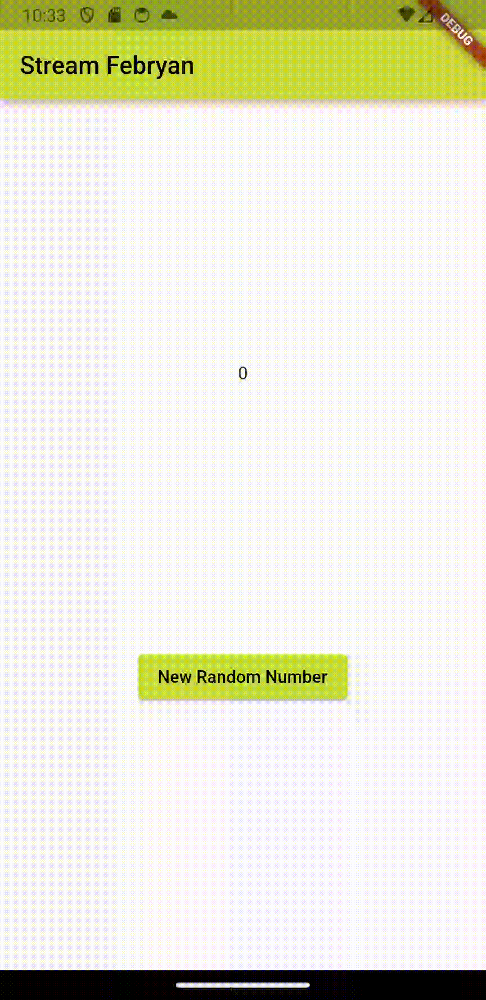

# Nama : Febryan Rizki Hidayatullah
# Kelas : TI-3F
# Nim : 2141720059
# WEEK 13
~~

## Praktikum 1: Dart Streams
### Soal 1
- Tambahkan nama panggilan Anda pada title app sebagai identitas hasil pekerjaan Anda.  
```dart
title: 'Stream Febryan',
```
- Gantilah warna tema aplikasi sesuai kesukaan Anda. 
```dart
theme: ThemeData(primarySwatch: Colors.lime),
``` 
- Lakukan commit hasil jawaban Soal 1 dengan pesan "W13: Jawaban Soal 1"  

### Soal 2
- Tambahkan 5 warna lainnya sesuai keinginan Anda pada variabel colors tersebut.  
```dart
import 'package:flutter/material.dart';

class ColorStream {
  final List<Color> colors = [
    Colors.blueGrey,
    Colors.amber,
    Colors.deepPurple,
    Colors.lightBlue,
    Colors.teal,
    // Tambahkan 5 warna lainnya sesuai keinginan Anda pada variabel colors tersebut.
    Colors.green.shade800,
    Colors.indigo,
    Colors.pinkAccent,
    Colors.orangeAccent,
    Colors.lightGreen,
  ];
}
```
- Lakukan commit hasil jawaban Soal 2 dengan pesan "W13: Jawaban Soal 2"

### Soal 3
- Jelaskan fungsi keyword yield* pada kode tersebut!  
jawab -> yield* digunakan untuk mengirimkan nilai dari suatu Stream atau Iterable ke Stream yang sedang dibuat. Dalam kasus ini, kita menggabungkan nilai dari Stream.periodic dengan mengembalikan nilai-nilai dari array colors pada interval waktu tertentu.
- Apa maksud isi perintah kode tersebut?  
jawab -> Kode tersebut membuat sebuah Stream yang secara periodik mengeluarkan nilai dari sebuah array warna pada interval waktu satu detik, dengan setiap nilai dari array warna dipilih secara bergantian sesuai dengan waktu dalam detik sejak dimulainya Stream.
- Lakukan commit hasil jawaban Soal 3 dengan pesan "W13: Jawaban Soal 3"  

### Soal 4
- Capture hasil praktikum Anda berupa GIF dan lampirkan di README.  
</img>
- Lakukan commit hasil jawaban Soal 4 dengan pesan "W13: Jawaban Soal 4"  

### Soal 5
- Jelaskan perbedaan menggunakan listen dan await for (langkah 9) !  
jawab -> Dalam konteks kode yang diberikan, menggunakan listen berarti ketika Stream mengeluarkan nilai baru, fungsi setState akan dipanggil untuk memperbarui bgColor, namun proses eksekusi selanjutnya tidak akan menunggu sampai nilai tersebut diterima. Sebaliknya, dengan await for, proses akan menunggu sampai nilai dari Stream diterima sebelum melanjutkan ke langkah selanjutnya.  
`jadi perbedaannya adalah await for menunggu nilai sampai selesai sebelum lanjut, sedangkan listen tidak perlu menunggu.`
- Lakukan commit hasil jawaban Soal 5 dengan pesan "W13: Jawaban Soal 5"  

### Soal 6
- Jelaskan maksud kode langkah 8 dan 10 tersebut!  
  jawab :  
  `langkah 8` : pertama-tama, sebuah instance dari NumberStream diciptakan untuk menginisialisasi stream controller dan sink-nya. stream kemudian diambil dari controller dengan menggunakan numberStreamController.stream. Kemudian, listen digunakan pada stream untuk mendengarkan perubahan yang terjadi pada Stream. Ketika ada perubahan (saat angka baru ditambahkan ke dalam Stream), fungsi yang diberikan akan dipanggil. Di sini, nilai yang diterima dari Stream akan diperbarui dalam state dengan menggunakan setState, dan nilai terakhir lastNumber akan diperbarui dengan nilai dari Stream.  
  `langkah 10` : addRandomNumber() method yang bertujuan untuk menambahkan angka acak ke dalam Stream. Pertama, sebuah objek dari kelas Random diciptakan untuk menghasilkan angka acak. Kemudian, angka acak di-generate menggunakan nextInt(10) untuk mendapatkan angka random dari 0 hingga 9. Terakhir, angka tersebut ditambahkan ke dalam Sink yang ada di numberStream melalui method addNumberToSink().
- Capture hasil praktikum Anda berupa GIF dan lampirkan di README.  
</img>
- Lalu lakukan commit dengan pesan "W13: Jawaban Soal 6".  