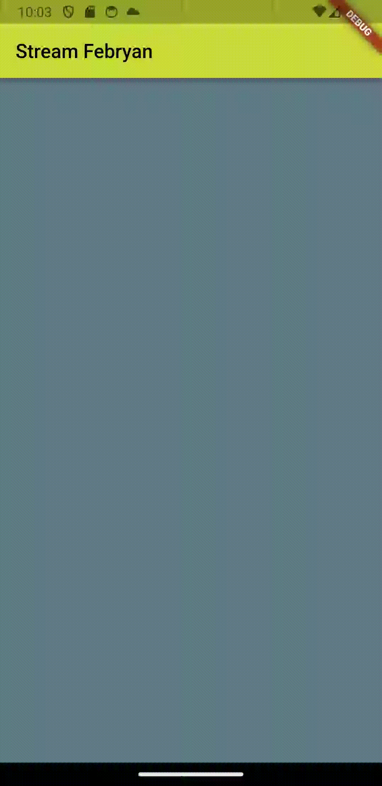

# Nama : Febryan Rizki Hidayatullah
# Kelas : TI-3F
# Nim : 2141720059
# WEEK 13
~~

## Praktikum 1: Dart Streams
### Soal 1
- Tambahkan nama panggilan Anda pada title app sebagai identitas hasil pekerjaan Anda.  
```dart
title: 'Stream Febryan',
```
- Gantilah warna tema aplikasi sesuai kesukaan Anda. 
```dart
theme: ThemeData(primarySwatch: Colors.lime),
``` 
- Lakukan commit hasil jawaban Soal 1 dengan pesan "W13: Jawaban Soal 1"  

### Soal 2
- Tambahkan 5 warna lainnya sesuai keinginan Anda pada variabel colors tersebut.  
```dart
import 'package:flutter/material.dart';

class ColorStream {
  final List<Color> colors = [
    Colors.blueGrey,
    Colors.amber,
    Colors.deepPurple,
    Colors.lightBlue,
    Colors.teal,
    // Tambahkan 5 warna lainnya sesuai keinginan Anda pada variabel colors tersebut.
    Colors.green.shade800,
    Colors.indigo,
    Colors.pinkAccent,
    Colors.orangeAccent,
    Colors.lightGreen,
  ];
}
```
- Lakukan commit hasil jawaban Soal 2 dengan pesan "W13: Jawaban Soal 2"

### Soal 3
- Jelaskan fungsi keyword yield* pada kode tersebut!  
jawab -> yield* digunakan untuk mengirimkan nilai dari suatu Stream atau Iterable ke Stream yang sedang dibuat. Dalam kasus ini, kita menggabungkan nilai dari Stream.periodic dengan mengembalikan nilai-nilai dari array colors pada interval waktu tertentu.
- Apa maksud isi perintah kode tersebut?  
jawab -> Kode tersebut membuat sebuah Stream yang secara periodik mengeluarkan nilai dari sebuah array warna pada interval waktu satu detik, dengan setiap nilai dari array warna dipilih secara bergantian sesuai dengan waktu dalam detik sejak dimulainya Stream.
- Lakukan commit hasil jawaban Soal 3 dengan pesan "W13: Jawaban Soal 3"  

### Soal 4
- Capture hasil praktikum Anda berupa GIF dan lampirkan di README.  
</img>
- Lakukan commit hasil jawaban Soal 4 dengan pesan "W13: Jawaban Soal 4"  